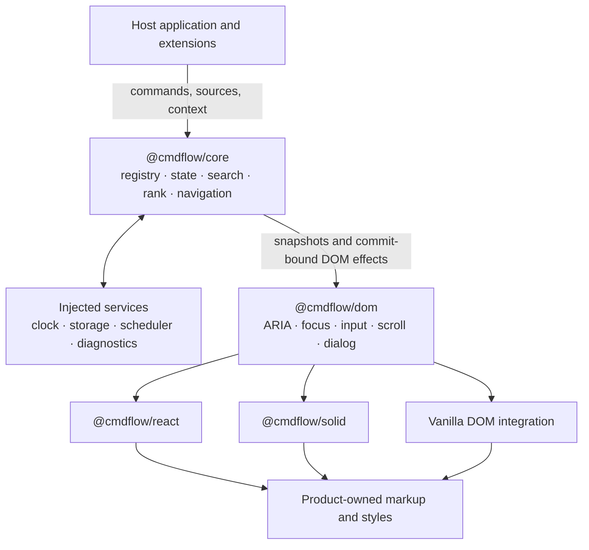

# CmdFlow architecture and product direction

| Field | Value |
| --- | --- |
| Status | Proposal and implementation north star |
| Audience | Maintainers, contributors, framework-adapter authors, and coding agents |
| Last updated | 2026-09-12 |
| Scope | Pre-1.0 product model, package boundaries, interaction contract, and delivery plan |

CmdFlow is not another styled command menu. It is a framework-agnostic engine for building
context-aware command and action experiences: global palettes, item action panels, nested flows,
forms, async search, and learned ranking. Products should be able to supply their own markup and
visual design while CmdFlow supplies the difficult behavior underneath.

This document is an architectural direction, not a frozen public API. Illustrative TypeScript is
included to make boundaries and invariants concrete. Names may change as the first vertical slices
are implemented.

The first implementation now lives in the workspace packages. Read
[implementation status](implementation.md) before treating an illustrative interface here as
shipped API. That companion document records executable coverage and outstanding release gates.

## Executive decision

> CmdFlow should be **DOM-aware at the interaction boundary, not DOM-driven at its state
> boundary**.

The recommended architecture is:

1. `@cmdflow/core` is a deterministic, DOM-free TypeScript engine. It owns registration,
   context, state transitions, navigation, search orchestration, ranking, and effect descriptions.
2. `@cmdflow/dom` connects that engine to browser behavior: ARIA relationships, focus, keyboard
   and pointer input, dialogs, scrolling, element registration, and live announcements.
3. Framework packages are thin lifecycle and rendering adapters. React is first; a small Solid
   implementation must validate the boundary before the core API is declared stable.
4. The product model keeps three structures separate: the command registry, the main view stack,
   and the contextual action-panel stack.
5. Personal ranking is local, explainable, bounded, and updated only after successful execution.
6. Accessibility is part of the behavior contract. Preset CSS is optional; correct semantics and
   keyboard behavior are not.

Using DOM APIs directly is valuable for focus, event routing, measurement, and scrolling. It is
not an automatic performance improvement for application state. Putting DOM nodes or browser
events in the core would make deterministic tests, server rendering, async ordering,
virtualization, and additional framework adapters harder. This separation is also used by
[Floating UI's platform layer](https://floating-ui.com/docs/platform) and
[Zag's machine/connect/adapter model](https://zagjs.com/guides/framework-adapters).

## The product abstraction

The central abstraction is:

> A context-aware registry of executable operations, projected into searchable views and
> contextual action surfaces, coordinated by a navigation and feedback engine.

That definition is intentionally broader than a combobox. A combobox is one accessible rendering
pattern inside CmdFlow, but it does not describe registration, nested views, forms, async sources,
execution, learning, or contextual actions.

### The reference experience

The supplied screenshot and the target Raycast-like workflow imply this contract:

1. A user opens CmdFlow and types `github`.
2. Local commands and remote results arrive, merge, and remain keyboard-navigable.
3. The user moves to the sixth result and successfully invokes it.
4. On a later equivalent search, that result receives a bounded promotion because of the
   successful feedback. Among otherwise equivalent `github` matches it should become the first
   result; it does not outrank an exact alias, a favorite, or a substantially better text match.
5. Pressing `Cmd/Ctrl+K` opens actions for the active result without changing the underlying query
   or active result.
6. An action can open a submenu, push a child list, show a detail view, or enter a form.
7. Back/Escape restores the previous action surface or view with its query, active item, scroll
   position, and safe draft state intact.
8. The host product controls the visible markup and can use low-level bindings, high-level
   primitives, a scoped reset, a preset, or entirely custom CSS. Any internal accessibility part
   is documented and replaceable through the same contract.

The footer should be derived from the active item's primary actions rather than maintained as a
second source of truth. Raycast similarly makes the first actions primary/secondary and supports
contextual action submenus; see its
[Action Panel API](https://developers.raycast.com/api-reference/user-interface/action-panel) and
[Action Panel guide](https://manual.raycast.com/action-panel).

## What existing tools teach us

| Reference | Useful lesson | Gap CmdFlow is designed to fill |
| --- | --- | --- |
| [Raycast](https://manual.raycast.com/search-bar) | Navigation stacks, contextual actions, custom search, forms, and frecency form one coherent product system. | Its implementation model is not a framework-neutral web library. |
| [GitHub command palette](https://docs.github.com/en/get-started/accessibility/github-command-palette) | Search modes, scope narrowing, and current-page context make a palette more useful than global fuzzy search alone. | It is product behavior, not reusable infrastructure. |
| [VS Code commands and context keys](https://code.visualstudio.com/api/references/when-clause-contexts) | Register behavior once, contribute it to several surfaces, and decide visibility/enabled state from context. | Its extension host and UI contracts are specific to VS Code. |
| [`cmdk`](https://github.com/pacocoursey/cmdk) | A small, composable command-menu primitive with strong consumer ownership is excellent React DX. | Registration, async provider policy, learned ranking, richer navigation, and cross-framework state are outside its scope. |
| [`kbar`](https://github.com/timc1/kbar) | Action registration, nesting, shortcuts, history, and headless rendering belong together. | CmdFlow needs a broader view/action/source model and explicit framework separation. |
| [Zag](https://zagjs.com/guides/building-machines) | Framework-neutral state plus a DOM connection layer can power idiomatic adapters. | CmdFlow's domain-specific registry, navigation, source, and learning behavior still needs to be designed. |
| [WAI-ARIA APG](https://www.w3.org/WAI/ARIA/apg/patterns/combobox/) | Dialog, combobox, listbox, menu, and form patterns give us candidate semantics for each surface. | APG does not define a command-palette pattern; the composed mapping still requires browser/assistive-technology validation. |

The opportunity is the space between an accessible UI primitive and a full product-specific
command system.

## Design principles

### 1. Stable identity over rendered content

Commands, results, sources, actions, and views have stable namespaced IDs. DOM order,
`textContent`, array indexes, or framework component identity must never become business identity.
Learned ranking and async batches will reorder items frequently.

### 2. One execution path

A command invoked from the root palette, an item action panel, a keyboard shortcut, a context
menu, or application code goes through the same executor. Eligibility, pending state, errors,
telemetry events, abort behavior, and learning therefore remain consistent.

### 3. Headless does not mean behaviorless

Consumers own markup and visual styling, but CmdFlow owns documented interaction invariants.
Required roles, labels, focus relationships, and keyboard behavior cannot silently disappear when
props are merged.

### 4. Determinism before cleverness

Given the same snapshot, event, context, clock, and source batches, the core produces the same next
snapshot and effect descriptions. Search and ranking should be explainable in development builds.

### 5. Progressive capability

A synchronous list of commands must be easy. Remote providers, nested views, learning,
virtualization, and draft persistence layer on without changing the basic mental model.

### 6. Few packages, strong boundaries

Create a package only when it has an independent runtime or release boundary. Export types beside
their implementation. Do not create generic `types`, `config`, `fuzzy`, or `storage` packages.

### 7. Framework neutrality must be proven

Avoid React-shaped concepts in core: no React nodes, synthetic events, hooks, portals, or render
callbacks. A small second adapter is an architecture test, not a post-1.0 nice-to-have.

## Explicit non-goals for the first release

- A secure runtime for executing untrusted third-party plugins.
- A complete form library or schema-validation system.
- A general application router, data cache, or analytics platform.
- Cloud-synchronized personalization.
- An expression language matching VS Code's full `when` clause syntax.
- Built-in AI intent prediction.
- Mandatory virtualization for ordinary command sets.
- A global CSS reset or a fixed Raycast visual clone.
- A universal shortcut that overrides editors, inputs, browser bindings, or host-product policy.

## Layered architecture



### Package boundaries

#### `@cmdflow/core`

Owns:

- extension and command registration;
- typed runtime context and applicability;
- immutable snapshots, events, selectors, and transitions;
- main navigation and action-panel stacks;
- result-source orchestration and batch merging;
- matching and ranking policies;
- execution lifecycle and outcomes;
- persistence interfaces, migrations, and public diagnostic events.

It must not import DOM libraries, access browser globals, retain element references, emit JSX, or
accept framework render nodes.

Start with no core runtime dependency if the first reducer, external store, and ranking pipeline
remain small. Designing transitions as a state machine does not require adopting a general
state-machine runtime. Reconsider that choice only if parallel states, actor lifecycles, or
visualization needs become complex enough that a dependency removes more code than it adds.

Using the standard `AbortSignal` shape for cancellation is intentional; “DOM-free” here means no
browser globals, elements, or DOM-owned state at runtime. Before stabilizing declarations, verify
that the supported non-browser TypeScript environments expose that type. If they do not, publish a
small structural cancellation interface that native `AbortSignal` satisfies.

#### `@cmdflow/dom`

Owns browser-only behavior:

- element registration and stable ARIA relationships;
- `Document`/`ShadowRoot` scoping;
- native event handling, optional vanilla delegation, and input-modality tracking;
- composition/IME guards and shortcut matching;
- focus capture, focus restoration, and modal lifecycle;
- active-item scrolling and measurements;
- live-region announcements;
- browser persistence implementations; and
- optional reset and preset CSS exports.

This should become a separate package when its first implementation is added. Keeping the reset as
`@cmdflow/dom/reset.css` and the optional visual preset as `@cmdflow/dom/preset.css` avoids an empty
styles package initially. Split `@cmdflow/styles` later only if its release or ownership genuinely
diverges.

#### `@cmdflow/react`

Owns:

- `useSyncExternalStore` integration;
- providers, hooks, parts, ref composition, and React prop normalization;
- hydration-safe IDs and framework lifecycle;
- both high-level primitives and low-level prop getters.

React remains a peer dependency. The adapter depends on core and DOM, but neither of those depends
on React.

#### Future adapters and tools

Add `@cmdflow/solid` after the first synchronous vertical slice, before freezing the public core
contract. `@cmdflow/testing` and `@cmdflow/devtools` are reasonable later packages once real code
justifies them. Until then, test helpers and diagnostics can live under core/DOM subpath exports.

### Dependency rules

```text
core  <-  dom  <-  react
             \-  solid
             \-  vanilla host code
```

- Dependencies point toward the core; framework knowledge never points back into it.
- Core returns data and effect descriptions, not rendered UI or direct DOM mutations.
- The DOM layer performs only commit-bound DOM effects after the adapter confirms the relevant
  elements are committed. Source, action, and persistence effects remain core-runtime work.
- Adapters render the engine's ordered keyed data. The engine never reaches behind a framework to
  reorder DOM nodes.

## Three structures, not one tree

CmdFlow needs three independent structures with different lifecycles.

| Structure | Purpose | Example |
| --- | --- | --- |
| Registry graph | Everything currently available to the application | GitHub commands register on sign-in and dispose on sign-out. |
| Main view stack | The user's navigation history inside the panel | Root results → pull requests → pull request detail → edit form. |
| Action-panel stack | Contextual actions for the current view/item | Pull request actions → change state submenu. |

Opening an action submenu must not push the main navigation stack. Unregistering an extension must
remove its contributions safely without corrupting an existing frame. A frame that loses its
active item chooses a deterministic fallback or pops if its entire view is no longer valid.

## Core state and transition model

The core is an external store around a pure transition function. Snapshots carry a monotonically
increasing revision and are deeply immutable by ownership contract. Repeated `getSnapshot()` calls
return the same object until a transition commits; this is required by React's
[`useSyncExternalStore`](https://react.dev/reference/react/useSyncExternalStore).
`ReadonlySnapshot<T>` below denotes that deep ownership contract, not TypeScript's shallow
`Readonly<T>` utility.

```ts
declare const candidateIdBrand: unique symbol;

export type CandidateId = string & {
  readonly [candidateIdBrand]: "CandidateId";
};

export interface ContextStore<TContext> {
  getSnapshot(): ReadonlySnapshot<TContext>;
  subscribe(listener: () => void): () => void;
}

export interface CmdFlowStore<TContext> {
  getSnapshot(): ReadonlySnapshot<CmdFlowSnapshot<TContext>>;
  getServerSnapshot(): ReadonlySnapshot<CmdFlowSnapshot<TContext>>;
  subscribe(listener: () => void): () => void;
  send(event: CmdFlowEvent): TransitionReceipt;
  destroy(): void;
}

export interface TransitionReceipt {
  changed: boolean;
  revision: number;
}
```

Core creates each opaque `CandidateId` from the registered source ID plus the source-local item ID
using a collision-free encoding, not naive delimiter concatenation. Every cross-source boundary—
activation, selection, execution, DOM registration, ranking, framework keys, and diagnostics—uses
that branded identity.

Adapters build selector subscriptions over this minimal contract. The server snapshot is a stable
closed state or an explicit hydration seed; it must agree with the first client snapshot. Exposed
arrays and records are readonly. `Map`, `Set`, and result payload objects must not be mutated after
publication; producers replace an item to change it. In development, freeze what is practical and
warn on reused mutable payloads.

Application context is reactive. The factory accepts a `ContextStore<TContext>` (or a convenience
`setContext` store), subscribes to it, and reevaluates applicability, sources, and ranking when its
version changes. Predicates receive a rich evaluation value containing `{ appContext, surface,
frame, item, selection }`, not application context alone.

The store consumes domain events, never native events or elements:

```ts
interface SurfaceAddress {
  surface: "main" | "actions";
  frameId: string;
}

type CmdFlowEvent =
  | { type: "OPEN"; reason: "shortcut" | "pointer" | "programmatic" }
  | { type: "CLOSE"; reason: "escape" | "outside" | "invoked" | "programmatic" }
  | {
      type: "INPUT_CHANGED";
      address: SurfaceAddress;
      value: string;
      phase: "composing" | "committed";
    }
  | {
      type: "MOVE_ACTIVE";
      address: SurfaceAddress;
      direction: "next" | "previous" | "first" | "last";
    }
  | {
      type: "SET_ACTIVE";
      address: SurfaceAddress;
      candidateId: CandidateId;
      modality: "keyboard" | "pointer";
    }
  | {
      type: "PUSH_VIEW";
      from: SurfaceAddress;
      target: "main" | "actions";
      view: ViewDescriptor;
    }
  | { type: "POP_VIEW"; address: SurfaceAddress }
  | { type: "OPEN_ACTIONS"; from: SurfaceAddress; candidateId?: CandidateId }
  | { type: "CLOSE_ACTIONS"; frameId: string }
  | { type: "INVOKE"; address: SurfaceAddress; candidateId?: CandidateId; actionId: string }
  | { type: "CONTEXT_CHANGED"; version: number }
  | { type: "SOURCE_BATCH_RECEIVED"; request: RequestIdentity; batch: ResultBatch }
  | { type: "EXECUTION_FINISHED"; executionId: string; outcome: ExecutionOutcome };
```

Pure transitions produce two effect classes with unique IDs and their originating revision:

```ts
interface EffectIdentity {
  id: string;
  revision: number;
}

type RuntimeEffect = EffectIdentity &
  (
    | { type: "run-source"; request: SearchRequest }
    | { type: "run-action"; execution: ActionExecution }
    | { type: "commit-ranking-feedback"; commit: FeedbackCommit }
  );

type DomEffect = EffectIdentity &
  (
    | { type: "focus"; part: PartIdentity; coalesceKey: string }
    | { type: "scroll-active-into-view"; frameId: string; coalesceKey: string }
    | { type: "announce"; message: Announcement }
  );

interface TransitionPlan<TContext> {
  snapshot: ReadonlySnapshot<CmdFlowSnapshot<TContext>>;
  runtimeEffects: readonly RuntimeEffect[];
  domEffects: readonly DomEffect[];
}
```

The core runtime is the sole executor of source, action, and persistence effects. It dequeues them
outside framework render lifecycles and guarantees each effect ID runs at most once, including
under React Strict Mode. Results return as versioned domain events. Feedback commits also carry an
execution idempotency key so an explicit storage retry cannot count one successful action twice.

Only DOM effects cross into an adapter. They are queued by revision, applied after that snapshot's
DOM has committed, and acknowledged by ID. Superseded focus/scroll work is discarded or coalesced;
announcements are acknowledged so a repeated framework effect does not speak twice. This delivery
protocol must be settled before implementation—returning every effect directly from `send()` is
not sufficient.

The engine never assumes that a microtask means React, Solid, or another renderer has committed.
Server rendering reads the server snapshot; DOM bindings and effects are created only after a
client adapter mounts.

### State invariants

- Every active ID exists in the current logical collection and is navigable. A visible disabled
  result may be active so its reason can be discovered, but it is never invocable.
- `activeId`, committed selection, multi-selection, DOM focus, and executing action are distinct.
- A frame's query and provider results cannot be changed by a stale request.
- Closing the action panel does not change the main frame's active item.
- Popping a frame restores its preserved state rather than reconstructing it from the DOM.
- Registry mutations are transactional; subscribers never observe a half-registered extension.
- Duplicate registry IDs throw in development. In production, the first registration remains,
  the later one is rejected, and a diagnostic event is emitted.
- User callbacks never run while internal state is partially mutated.
- Runtime effects execute at most once; committed DOM effects are not applied to stale revisions.

### Controlled and uncontrolled state

The core should own transient interaction state by default. Framework primitives can offer familiar
`open/defaultOpen/onOpenChange` and `query/defaultQuery/onQueryChange` ergonomics, but each state
slice has exactly one writer. A controlled slice is read from the host and proposed changes are
reported; it is not shadowed by a second internal value.

Do not make every internal field controllable. Active IDs, provider generations, execution state,
and action-stack bookkeeping should remain engine-owned unless a real integration need proves
otherwise.

## Registry, context, and execution

Commands and actions share an executable base. A command describes a discoverable operation; a
view or result can contribute additional contextual actions using the same executor.

```ts
const cmdflow = createCmdFlow<AppContext>({
  id: "product-command-panel",
  context: appContextStore,
  clock,
  storage,
  ranking: createDefaultRankingPolicy(),
});

const dispose = cmdflow.registerExtension(
  defineExtension({
    id: "github",
    commands: [
      defineCommand({
        id: "github.pullRequests.open",
        title: "My Pull Requests",
        keywords: ["github", "prs"],
        visible: ({ appContext }) => appContext.integrations.github.connected,
        enabled: ({ appContext }) =>
          appContext.network.online || { reason: "You are offline" },
        run: async ({ signal }) => ({
          type: "push-view",
          target: "main",
          view: { id: "github.pullRequests", type: "list" },
        }),
      }),
    ],
  }),
);
```

### Registry requirements

- Stable namespaced IDs such as `github.pullRequests.open`.
- Dynamic registration with an idempotent disposer.
- Atomic extension registration so commands, sources, and render descriptors appear together.
- Lazy extension activation without changing the identity of already-visible contributions.
- Separate `visible` and `enabled` predicates; disabled entries can explain why.
- Typed context evaluated from a current snapshot, not serialized into persistence.
- Contribution locations such as root palette, item action panel, context menu, inline action, or
  programmatic-only.
- Per-extension error isolation and development diagnostics.

Compile-time application modules are enough for v1. They must not be marketed as a secure plugin
sandbox for arbitrary third-party JavaScript.

### Actions and outcomes

```ts
interface ActionDefinition<TContext> {
  id: string;
  title: string;
  subtitle?: string;
  keywords?: readonly string[];
  shortcut?: Keybinding;
  section?: string;
  destructive?: boolean;
  priority?: "primary" | "secondary" | "auxiliary";
  lifecycle?: "origin-bound" | "detached";
  visible?: (input: ActionEvaluation<TContext>) => boolean;
  enabled?: (input: ActionEvaluation<TContext>) => boolean | { reason: string };
  learn?: boolean;
  run(input: ActionRunInput<TContext>): void | ActionOutcome | Promise<void | ActionOutcome>;
}

type ActionOutcome =
  | { type: "stay" }
  | { type: "close"; target: "shell" | "actions" }
  | { type: "pop-view"; target: "origin" | "main" | "actions" }
  | {
      type: "push-view";
      target: "origin" | "main" | "actions";
      view: ViewDescriptor;
    }
  | {
      type: "replace-view";
      target: "origin" | "main" | "actions";
      view: ViewDescriptor;
    };
```

An invocation has a stable execution ID and an `AbortSignal`. Learning occurs only if the handler
resolves successfully and the command is eligible for learning. A rejected, canceled, or aborted
execution never produces positive feedback.

Every surface invocation captures `{ instanceId, openSessionId, originAddress, targetFrameIds,
registryRevision }`.
Outcomes resolve relative targets against that captured session, never whichever frame happens to
be current when a promise finishes. If the origin frame/session is gone or the contribution was
disposed, its UI outcome is ignored and a diagnostic completion is still emitted. Origin-bound
work is aborted when its origin is disposed; an explicitly detached action may finish its external
work, but cannot mutate a newer UI session.

Programmatic `cmdflow.invoke()` may supply an explicit live surface address. Without one, the
action can perform application work and report completion, but any navigation/close outcome is
rejected; there is no implicit “current panel” target.

The executor reevaluates visibility and enabled state at invocation time for every entry point;
programmatic invocation does not bypass a disabled action unless a separate privileged host API is
explicitly designed later.

At most one currently visible action may declare `priority: "primary"`, and at most one may declare
`"secondary"`. A declared but disabled primary remains visible with its reason and cannot invoke.
If no primary is declared, the resolver chooses the first stable, visible, enabled,
non-destructive action; if none exists, there is no Enter action. Duplicates warn in development;
in production the first action in stable declared order keeps the priority and later duplicates
become auxiliary. Additional visible actions populate the footer and contextual action surface.
Destructive actions require an explicit confirmation policy and are never selected as an implicit
primary merely because of registration order.

## Views and navigation

A view is a framework-neutral descriptor. Arbitrary render values stay in the adapter: a custom
view uses a stable renderer key plus typed data, not a `ReactNode` stored in core.

```ts
type ViewDescriptor =
  | ListViewDescriptor
  | DetailViewDescriptor
  | FormViewDescriptor
  | { id: string; type: "custom"; rendererKey: string; payloadKey?: string };

interface NavigationFrame {
  id: string;
  view: ViewDescriptor;
  query: string;
  activeId: CandidateId | null;
  selectedIds: readonly CandidateId[];
  scrollAnchor: { candidateId: CandidateId; offset: number } | null;
  sourceState: Readonly<Record<string, SourceSnapshot>>;
  draftKey?: string;
}
```

Standard list/detail/form descriptors and their field metadata are portable. A custom renderer is
portable only when each framework host registers the same `rendererKey` and understands the same
immutable payload contract; otherwise it is an intentional adapter-specific escape hatch. Core
keeps opaque payloads in a host-owned registry by key instead of storing React/Solid/Vue nodes or
mutable component instances in snapshots.

Core operations are `push`, `replace`, `pop`, and `resetToRoot`. Every frame preserves its own
query, active item, selection, source state, and scroll anchor. The action surface owns a separate
mini-stack for submenus and inline interactions.

Entering a child list is product navigation, not necessarily an ARIA tree. Use `role="tree"` only
when multiple hierarchy levels are visible simultaneously and the full
[tree keyboard model](https://www.w3.org/WAI/ARIA/apg/patterns/treeview/) is implemented.

### Escape and Back precedence

Escape behavior is deterministic and handled from the innermost active surface outward:

1. Let an active IME/composition or temporary native interaction consume the key.
2. Close a confirmation, action submenu, or action panel.
3. Pop a nested form/detail/list view.
4. Clear a non-empty root query if the host enables that convention.
5. Close the CmdFlow surface and restore focus.

Backspace-to-pop is opt-in, works only when the current search input is empty, and never steals a
text-editing operation. A visible Back control remains available.

## Search and result sources

Search supports local, remote, and hybrid providers without forcing them into one global loading
state.

```ts
interface ResultSource<TData, TContext> {
  id: string;
  sourcePriority?: number;
  search(request: {
    rawQuery: string;
    normalizedQuery: string;
    normalizationVersion: string;
    scope: SearchScope;
    context: ReadonlySnapshot<TContext>;
    cursor?: string;
    signal: AbortSignal;
  }):
    | FinalResultBatch<TData>
    | Promise<FinalResultBatch<TData>>
    | AsyncIterable<ResultBatch<TData>>;
}

interface ResultItem<T = unknown> {
  id: string;
  title: string;
  subtitle?: string;
  keywords?: readonly string[];
  aliases?: readonly string[];
  section?: string;
  providerRank?: number;
  disabled?: boolean | { reason: string };
  data: Readonly<T>;
}

type BatchMutation<T> =
  | {
      operation: "replace";
      items: readonly ResultItem<T>[];
    }
  | {
      operation: "patch";
      items: readonly ResultItem<T>[];
      remove?: readonly string[];
    };

type ResultBatch<T = unknown> =
  | (BatchMutation<T> & { done: false; nextCursor?: never })
  | FinalResultBatch<T>;

type FinalResultBatch<T = unknown> = BatchMutation<T> & {
  done: true;
  nextCursor?: string;
};
```

Candidate identity is the opaque core-generated `CandidateId` described above, derived from
`{ sourceId, itemId }`. An item ID needs to be stable only within its source. Core attaches the
enclosing source ID to every emitted item; a provider cannot spoof or disagree with it.

`replace` replaces that source's current collection for the request generation. `patch` upserts
items by composite identity and removes the listed source-local IDs. `remove` is invalid on a
`replace`; for a `patch`, removals happen before upserts, so an ID present in both ends present.
`done` ends the current page request or progressive iterator; `nextCursor` advertises a subsequent
explicit page in the same search epoch. A source abort closes an async iterator by calling its
`return()` when available. Duplicate IDs inside a batch are a development error and use one
deterministic fallback in production: the last occurrence in that batch's declared array wins.
Synchronous and Promise sources must return a final batch. Only `AsyncIterable` can emit
`done: false`, and `nextCursor` appears only on its final batch. If an iterator returns naturally
without one, core deterministically closes the page with no next cursor and emits a diagnostic.

`sourcePriority` is a fixed safe integer at registration and defaults to `0`; invalid or non-finite
values become the default with a diagnostic. `providerRank` is an optional non-negative safe
integer stable ordinal, never inferred from batch arrival. Invalid values are treated as absent.
When it is absent, ranking falls directly to the canonical composite ID after other features.

Local matching uses the versioned normalized query. Sources receive both forms so product code can
preserve user intent, but every remote source must declare whether it sends the raw query, the
normalized query, or no query off-device. Registration can require host consent for that policy;
CmdFlow itself never transmits a query.

### Query pipeline

1. Normalize the query without destroying the original input displayed to the user.
2. Resolve current scope, mode, context, and eligible sources.
3. Filter/index local items and start remote sources with independent debounce/minimum-query
   policies.
4. Tag every request with `{ instanceId, frameId, sourceId, searchEpoch, pageRequestId }` and an
   abort signal.
5. Merge progressive batches by stable ID and retain per-source loading, error, cursor, and stale
   state.
6. Match and rank the logical collection.
7. Preserve `activeId` if it remains navigable; otherwise choose a deterministic nearest fallback.
8. Project the ordered results to adapters and announce settled changes without speaking every
   incremental batch.

Changing a query, popping its frame, unregistering its source, or destroying the instance aborts
the associated work. An abort is an expected control path, not an error. A response with an old
search epoch or page request is ignored even if the underlying transport did not honor
cancellation.

A query/scope/context change starts a new `searchEpoch` and invalidates every page from the old
one. The initial page may `replace`; later pages in that epoch must `patch` into the accumulated
collection. Page requests are serialized per source by default, each has its own request ID, and a
failed page leaves previously committed pages intact. Refresh starts a new epoch. Parallel page
loading is a future opt-in that must preserve provider ranks and reject stale page IDs.

### Streaming and stability policy

- Providers may yield progressive batches through `AsyncIterable`.
- One provider's error does not erase successful results from another.
- Late results may insert above the active item, but the active identity and viewport anchor stay
  stable while the user is navigating.
- Stable source priority, provider-declared base order, and IDs break otherwise-equal ties. Network
  arrival order is never a ranking signal.
- Pagination is explicit and cursor-based; reaching the last rendered row must not silently make
  keyboard behavior unpredictable.
- Provider quotas or grouping prevent a noisy source from consuming the entire visible list.
- Cache ownership is pluggable. Core defines stale/fresh semantics but does not become a general
  data-fetching cache.

Raycast's List API provides useful precedents for custom filtering, controlled search,
pagination, and abortable async work: see
[List](https://developers.raycast.com/api-reference/user-interface/list) and
[`usePromise`](https://developers.raycast.com/utilities/react-hooks/usepromise).

## Matching and learned ranking

The ranking system should feel adaptive without becoming opaque or unstable. It uses a staged,
mostly lexicographic comparison rather than one unconstrained “magic score.”

### Ranking pipeline

1. **Eligibility** — scope, mode, visibility, permissions, and source policy filter the candidate
   set.
2. **Explicit policy** — for an empty query, favorites use explicit user order. Under a non-empty
   query, favorites do not jump above more relevant results unless a host explicitly opts into that
   exceptional policy.
3. **Relevance band** — combine match tier, a quantized lexical-quality band, and contextual tier
   into a hard boundary. Match tiers include exact alias, alias prefix, exact title, title
   prefix/acronym/token-prefix, fuzzy title, exact/prefix keyword or subtitle, fuzzy metadata, and
   an explicitly allowed provider fallback.
4. **Bounded personalization inside the band** — exact query/context affinity, exact query/surface
   affinity, contextual item frecency, then global item frecency.
5. **Fine lexical order and stable fallback** — quantized lexical score, source priority,
   provider-supplied rank, then canonical composite ID.

Personalization must never make an irrelevant result beat an exact or materially better match.
Favorites and aliases remain explicit, inspectable controls. A source can opt out of
personalization, and an action can declare `learn: false`.

Each matcher publishes fixed band thresholds and fixtures; hosts contribute a small ordered context
tier rather than an arbitrary unbounded number. That makes “materially better” testable.

The v1 normalizer is executable and versioned:

```ts
export function normalizeQueryV1(input: string): string {
  return input.normalize("NFKC").trim().replace(/\s+/gu, " ").toLowerCase();
}
```

This intentionally uses ECMAScript's defined `trim`/`\s` set and locale-insensitive
`toLowerCase()`; it never uses the runtime's ambient locale. Conformance vectors cover ASCII/NBSP
and BOM whitespace, zero-width space, Turkish I, composed/decomposed accents, and astral code
points. Custom normalization supplies its own version and invalidates or migrates incompatible
query records. The original display query is retained separately.

Capture one `rankNow` instant for the entire pass. Validate persisted values, convert every numeric
comparison feature—not only lexical score—to a finite fixed-point integer, and compare this key
lexicographically in ascending order:

```ts
[
  policyTierAscending,
  relevanceBandAscending,
  exactContextAffinityDescending,
  exactSurfaceAffinityDescending,
  contextFrecencyDescending,
  globalFrecencyDescending,
  lexicalScoreDescending,
  sourcePriorityAscending,
  providerRankAscending,
  canonicalCompositeIdCodeUnitAscending,
];
```

The `Descending` fields are represented by an inverted fixed-point integer or compared explicitly;
the names above document direction. Finite supplied provider ranks precede missing/invalid ranks;
supplied ranks compare numerically, while missing ranks compare by canonical ID. Do not skip the
rank comparison pairwise when either candidate lacks it: that produces nontransitive comparisons.
Arrival order is never a fallback. The final ID comparison uses code-unit order rather than locale-sensitive
`localeCompare`. Comparator antisymmetry and transitivity are tested directly. Fixed-point features
also avoid letting implementation-approximated transcendental math decide a tie; see the
[ECMAScript Math specification](https://tc39.es/ecma262/multipage/numbers-and-dates.html).
With no learned data, ordering follows explicit policy, relevance and lexical quality, then the
stable source-priority, provider-rank, and canonical-ID fallbacks above.

### Feedback model

Record feedback only after a successful invocation, never after hover, highlight, selection
movement, a failed action, or cancellation.

A bounded, lazily decayed accumulator is sufficient for v1. Conceptually, the following starting
policy adapts Firefox's documented adaptive-history update:

```text
elapsedDays = max(0, now - updatedAt) / 86,400,000
decayed     = previousValue × 0.975 ^ elapsedDays
nextValue   = 0.9 × decayed + 1
```

Repeated immediate uses approach a bounded value of 10, while the daily factor gives roughly a
27-day half-life. V1 commits this integer implementation in core and exports it for persistence
adapters:

```ts
const VALUE_SCALE = 1_000; // one conceptual point
const VALUE_MAX = 10 * VALUE_SCALE;
const DECAY_BASIS_POINTS = 9_750;
const BASIS_POINTS = 10_000;
const DAY_MS = 86_400_000;
const RETENTION_DAYS = 180;

function roundHalfUp(value: number, divisor: number): number {
  return Math.floor((value + Math.floor(divisor / 2)) / divisor);
}

export function decayFrecencyV1(value: number, elapsedWholeDays: number): number {
  let next = Number.isSafeInteger(value) ? Math.max(0, Math.min(VALUE_MAX, value)) : 0;
  const days = Number.isSafeInteger(elapsedWholeDays)
    ? Math.max(0, Math.min(RETENTION_DAYS, elapsedWholeDays))
    : 0;

  for (let day = 0; day < days; day += 1) {
    next = roundHalfUp(next * DECAY_BASIS_POINTS, BASIS_POINTS);
  }
  return next;
}

export function recordSuccessfulUseV1(value: number, elapsedWholeDays: number): number {
  const decayed = decayFrecencyV1(value, elapsedWholeDays);
  return Math.min(VALUE_MAX, roundHalfUp(decayed * 9, 10) + VALUE_SCALE);
}
```

Each record stores `decayedThroughDay = floor(rankNow / DAY_MS)` separately from `lastUsedAt`.
`elapsedWholeDays` is `currentEpochDay - decayedThroughDay`; after decay, advance the stored day to
`currentEpochDay`. This preserves fractional remainder across frequent uses instead of resetting a
24-hour timer on every invocation. The 180-day v1 privacy retention bound also prevents malformed
input from creating an unbounded loop; an expired record is discarded before ranking rather than
kept at its 180-day decayed value. Reference vectors include `record(0, 0) = 1000`,
`record(1000, 0) = 1900`, `decay(1000, 1) = 975`, and `record(10000, 0) = 10000`. Storage adapters
import these functions; they do not reinterpret the conceptual floating-point formula.

Capture one finite integer `rankNow`. Clamp a `lastUsedAt` no more than five minutes in the future
to `rankNow`; discard a record beyond that default future-skew bound. Clamp a future
`decayedThroughDay` to `currentEpochDay`. Discard non-finite/unsafe score or timestamp values. Use
the sanitized last-use time for TTL. Decay on read/write rather than running a timer. Version
changes to scale, rounding, decay, retention, or skew policy and ship new vectors. Firefox's URL
bar is useful prior art for combining frequency, recency, decay, and adaptive query/item history;
see Mozilla's
[ranking documentation](https://firefox-source-docs.mozilla.org/browser/urlbar/ranking.html).
Records below the fixed-point equivalent of `0.1` may be pruned, but that threshold does not replace
an independent privacy retention deadline based on `lastUsedAt`.

For a scope with a `contextKey`, one successful use atomically updates four aggregates:

- exact-query/full-context: `{ subject, surface, context, queryKey, candidateId }`;
- exact-query/surface-only: `{ subject, surface, queryKey, candidateId }`;
- item/full-context: `{ subject, surface, context, candidateId }`; and
- item/surface-only: `{ subject, surface, candidateId }`.

Without a context key, update only the two surface records so one use is not counted twice. The
comparator consumes those aggregates in the same precedence order. “Global” in this document means
surface-wide for the current subject, not cross-user or cross-product.

V1 derives a `queryKey` from the exact normalized query for the operation that successfully
executed; only the `plain` retention strategy may persist the normalized text itself. A nested flow
does not back-propagate assumed success to earlier or later choices; each successfully executed
operation records its own query and surface. Abandoned, failed, and canceled operations do not
learn. Form fields, action arguments, passwords, and arbitrary text inputs are never ranking
queries.

Prefix affinity can be evaluated later as an experiment—either by read-time prefix matching or
separate 2–16-code-point associations—only after its privacy, reset, CJK, quota, and evaluation
contract is designed. Exact-query learning already implements the motivating repeated `github`
behavior without that extra inference.

The relevance band is the clamp: learned contribution cannot cross it. One successful repeated
query should make the chosen result first among otherwise equivalent candidates in that band. The
UI does not reorder around an active item immediately after invocation; the updated order applies
on a future equivalent query or opening.

### Persistence and privacy

Core depends on an injected contract, not a browser database:

```ts
interface RankingScope {
  subjectKey: string;
  surfaceId: string;
  contextKey?: string;
}

interface RankingStore {
  load(request: RankingLoadRequest): Promise<RankingProfile>;
  commit(commit: FeedbackCommit): Promise<void>;
  reset(selector: RankingResetSelector): Promise<void>;
  subscribe?(listener: RankingInvalidationListener): () => void;
}
```

- Ranking works in memory with no configuration.
- A browser persistence adapter can hydrate asynchronously from IndexedDB; opening the first panel
  must not block on storage.
- The pure in-memory ranker remains synchronous. Loading and committing persistence happens through
  injected runtime effects. Browser implementations live in `@cmdflow/dom/persistence`, not core.
- Persist only IDs, scope/query keys, decayed counters, timestamps, and schema version—not result
  payloads, application context, form values, or DOM data.
- `rankingScope` is explicitly supplied as `{ subjectKey, surfaceId, contextKey? }`. Never derive it
  automatically from a URL, repository name, selected text, or arbitrary application context.
  Keys are opaque, allowlisted, and should not contain personal data.
- Expose query retention as `none`, `fingerprint`, or `plain`. `none` persists only global item
  history. `plain` is explicit opt-in. The recommended browser `fingerprint` strategy uses a random
  per-profile, non-extractable HMAC-SHA-256 key stored in IndexedDB and domain-separated input that
  includes algorithm version, namespace, key kind, and normalized query. See the
  [Web Cryptography API](https://www.w3.org/TR/WebCryptoAPI/).
- HMAC derivation is asynchronous. Expose `rankingReady`/query-key readiness, tag derivation with
  the current request generation, and use text/global order while it is pending. Apply a late key
  only before the user navigates; otherwise defer it to the next equivalent query/opening.
- Store a `fingerprintKeyId` beside metadata and query records. If its non-extractable key is
  missing, replaced, or incompatible, atomically delete records for the old key before creating a
  new profile; do not leave unreadable query history behind.
- Fingerprinting limits casual disclosure in storage and logs; equality/frequency patterns still
  leak, and same-origin or XSS code can use the key. It is not a security boundary.
- Namespace records by the opaque subject/profile key and clear or rotate that namespace on logout
  and shared-device transitions. Counters and timestamps are sensitive even without payloads.
- Apply the v1 180-day privacy TTL independently of the score threshold and maximum count. Capture
  one time for pruning; evict expired records first, then lowest fixed-point decayed value, oldest
  `lastUsedAt`, and canonical key.
- Storage is versioned and migration failure falls back safely without breaking search.
- Resetting an item removes all of its learned context/query/global records while preserving
  intentional favorites and aliases. Resetting a query removes that exact query key. Also support
  extension/surface and global resets.
- Local-only is the default. Cross-tab updates can be best-effort through `BroadcastChannel`; cloud
  sync is out of scope for v1.
- IndexedDB denial, quota failure, corruption, or private-mode restrictions fall back to memory.
  Do not depend on unload-time writes or request persistent-storage permission automatically.
- A feedback commit contains every aggregate for one successful operation. Its IndexedDB adapter
  reads, decays, updates, prunes, and writes them in one `readwrite` transaction spanning every
  affected aggregate. Every mutating transaction—including feedback, reset, logout/namespace
  rotation, migration, and fingerprint-key rotation—broadcasts an opaque
  `{ namespace, revision }` invalidation only after completion. Other tabs purge/reload matching
  in-memory profiles from IndexedDB rather than trusting broadcast payloads. This relies on the
  [IndexedDB transaction model](https://www.w3.org/TR/IndexedDB/#transaction-construct).
- Connections close on `versionchange`; schema migration runs inside the upgrade transaction. A
  blocked or failed open/upgrade emits diagnostics and falls back to memory instead of leaving
  `rankingReady` unresolved.
- Hydrate eagerly when the CmdFlow instance is created. Hydration and cross-tab invalidation may
  reorder before the first navigation/input event while preserving `activeId`; afterward apply
  them on the next query or panel opening. Tests that assert persisted order await `rankingReady`.

### Ranking diagnostics

Development builds should answer “why is this here?” for every result:

```ts
interface RankExplanation {
  candidateId: CandidateId;
  eligible: boolean;
  policyTier: string;
  relevanceBand: string;
  lexicalScoreFixed: number;
  exactContextAffinityFixed: number;
  exactSurfaceAffinityFixed: number;
  contextFrecencyFixed: number;
  globalFrecencyFixed: number;
  sourcePriority: number;
  providerRank?: number;
  reason: string;
  finalOrder: number;
}
```

This explanation is also the basis for deterministic fixtures and future devtools.

## Browser semantics and accessibility

There is no ARIA `command-palette` role. The strongest v1 candidate mapping for the searchable
surface is below, but it remains a composed hypothesis to validate with real browsers and
assistive technologies rather than something APG endorses as a complete command palette:

```text
modal dialog
├── editable combobox input (DOM focus stays here)
└── listbox controlled by that input
    └── option for each result
```

The [combobox pattern](https://www.w3.org/WAI/ARIA/apg/patterns/combobox/) explicitly supports an
editable input with a listbox popup and virtual focus through `aria-activedescendant`.

### Search-list contract

The input has:

- an accessible label;
- `role="combobox"`;
- `aria-autocomplete="list"`;
- `aria-expanded`;
- `aria-controls` referencing the results list; and
- `aria-activedescendant` referencing the currently mounted active option.

The results container has `role="listbox"` and an accessible name. Each result has
`role="option"`. Active focus is represented by the input's `aria-activedescendant` plus a visual
`data-state="active"`; `aria-selected` maps only to a real committed selection. Omit it when the
mode has no selection, use true/false values in a selectable mode, and set
`aria-multiselectable="true"` on a multi-select listbox. A deliberate selection-follows-focus mode
must update the actual selection rather than only changing ARIA. Groups use `role="group"` and an
accessible label. A visible disabled result remains navigable, exposes
`aria-disabled="true"` plus a visible or `aria-describedby`-associated reason, and makes invocation
a no-op. APG explains why disabled
items in composite widgets may remain focusable/navigable in its
[keyboard-interface guidance](https://www.w3.org/WAI/ARIA/apg/practices/keyboard-interface/#focusabilityofdisabledcontrols).

DOM focus remains in the input while arrows move the active descendant. This preserves typing,
caret behavior, and IME input. The active result, a committed selection, and DOM focus remain
separate concepts.

The combobox input is the composite's sole tab stop. Options do not receive `tabindex="0"` or real
DOM focus. Up/Down navigate results; Tab moves among actual dialog controls. Left/Right and
Home/End preserve native input-caret behavior by default unless a clearly documented host mode
chooses otherwise.

Listbox options must not contain independently interactive buttons, links, or checkboxes. The
[listbox pattern](https://www.w3.org/WAI/ARIA/apg/patterns/listbox/) treats option descendants as
presentational. Put secondary actions in a separate action surface; use a grid only when rows truly
need several focusable cells and the full grid keyboard contract is implemented.

### Contextual actions

- A non-searchable actions surface can use a menu/menuitem composite and move real focus into it.
  A visible Actions trigger follows the menu-button pattern; the keyboard shortcut opens the same
  surface and focuses its appropriate first/current item.
- A searchable actions surface is another combobox/listbox view inside the outer dialog, not an
  input placed inside an ARIA menu.
- Each action surface captures its opener. Closing restores focus to the Actions button when it
  opened the surface, the search input when a shortcut opened it there, or the parent menu item
  when returning from a submenu. The target must still be connected, focusable, visible, and not
  inert; otherwise use the surface's logical fallback. The underlying active result is retained.
- Submenus replace only the current action-panel frame.
- Visible disabled actions remain arrow-navigable for discoverability, expose
  `aria-disabled="true"` and their reason, and cannot activate through Enter, Space, click, or
  programmatic invocation.

See the APG [menu button](https://www.w3.org/WAI/ARIA/apg/patterns/menu-button/) and
[menu](https://www.w3.org/WAI/ARIA/apg/patterns/menubar/) patterns.

### Forms and richer views

A form is a separate navigation view containing native labeled controls. Real DOM focus moves to
the first appropriate field; the combobox virtual-focus model is suspended. Submission uses a
native `<form>` contract and supports:

- controlled and uncontrolled fields;
- sync and async validation;
- first-invalid-field focus;
- `aria-invalid` plus error association through `aria-describedby` or `aria-errormessage`;
- an appropriate status announcement for async validation failure;
- pending and disabled submission;
- draft preservation and dirty-state handling;
- custom field registration; and
- exclusion of passwords and other host-declared secure values from persistence.

CmdFlow owns workflow and safe draft coordination, not a complete validation ecosystem. Raycast's
[Form API](https://developers.raycast.com/api-reference/user-interface/form) is useful product
precedent for validation and drafts.

### Modal behavior and focus restoration

The outer surface is a dialog; the result list alone is not. Define and test the modal contract
first, then choose native `<dialog>` versus a managed modal after an interoperability spike. Both
paths must meet the same observable behavior.

- Give the dialog itself an accessible name through a visible title and `aria-labelledby`, or an
  explicit `aria-label`; labeling only the search input is insufficient.
- Autofocus the search input on open.
- Keep Tab and Shift+Tab inside a modal surface.
- Provide a visible close control.
- On final close, restore focus only if the invoking element is still connected, visible,
  focusable, and not inert; otherwise use a host-provided logical fallback.
- A managed modal makes outside content genuinely inert, contains focus, and only then applies
  `aria-modal="true"`.
- For native dialog, use `showModal()`, `close()`, and `cancel`/`close` events rather than mutating
  its `open` attribute. Always prevent the native `cancel` default. If composition is active, do
  not request closure; otherwise emit a close request through the authoritative CmdFlow state.
  Call `dialog.close()` only after that state accepts the request and becomes closed; a controlled
  host may decline it.
- Never use positive `tabindex`.

See the [HTML dialog specification](https://html.spec.whatwg.org/multipage/interactive-elements.html#the-dialog-element)
and [APG modal dialog pattern](https://www.w3.org/WAI/ARIA/apg/patterns/dialog-modal/).

## Keyboard, pointer, and composition input

Use the DOM `input` event as the authoritative query change. Do not reconstruct text from
`keydown`; that misses paste, speech input, drag/drop, browser clear controls, autocomplete, and
other editing paths.

Use `keydown` only for recognized navigation and commands, in this order:

1. Let IME/composition own its keys.
2. Preserve native behavior for the focused editable control.
3. Apply the active CmdFlow surface's keymap.
4. Consider the document-level host-configured shortcut registry.

Requirements:

- Track `compositionstart`/`compositionend` and check `KeyboardEvent.isComposing`.
- Do not treat Enter, Escape, arrows, or printable keys as CmdFlow commands during composition.
- Update the displayed input value during composition, but by default defer providers, ranking
  churn, and result announcements until `compositionend`; then commit the final value once. Live
  composition search is an explicit opt-in.
- In framework adapters, compose consumer and internal logic into one element handler: run the
  consumer first and skip internal handling when `event.defaultPrevented`.
- Call `preventDefault()` only after a binding is recognized and handled.
- Do not call `stopPropagation()` by default.
- Allow key repeat for navigation; suppress repeat for open/invoke shortcuts.
- Use `KeyboardEvent.key` for logical shortcuts. Make physical `code` matching an explicit option.
- Make `Cmd/Ctrl+K` configurable; never assume the page receives every OS/browser shortcut.
- Avoid global single-character shortcuts, and expose a visible trigger.
- Show implemented shortcuts visually and describe them with `aria-keyshortcuts`; the attribute
  documents behavior but does not implement it. See the
  [`aria-keyshortcuts` definition](https://www.w3.org/TR/wai-aria-1.2/#aria-keyshortcuts).

Prop-getter/composed handlers are the canonical framework mode. Imperative event delegation is the
canonical vanilla mode. They must be mutually exclusive for the same element so one event cannot
be processed twice. Independent native listeners are reserved for document/root behavior with
explicit ordering; they cannot promise to run after React synthetic handlers.

Composition and event behavior are specified by
[UI Events](https://www.w3.org/TR/uievents/) and
[Input Events Level 2](https://www.w3.org/TR/input-events-2/).

### Pointer behavior

- Activate with `click`, which covers pointer and device-independent activation; do not execute on
  `pointerdown`.
- Synchronize `activeId` before a pointer invocation.
- Track input modality so a stationary pointer does not unexpectedly replace keyboard activity
  when filtering or scrolling moves rows beneath it.
- For hover-to-activate, require actual pointer-coordinate movement.
- Use delegated listeners and `event.composedPath()` for nested markup and open Shadow DOM.
- Own one `AbortController` per DOM controller and abort registered listeners on destroy.

## DOM roots, portals, and multiple instances

Never read global `document` in reusable code. Derive `ownerDocument` from a bound root and accept a
`Document | ShadowRoot` scope. This supports iframes, multiple windows, portals, test documents,
and open shadow roots.

Realm-sensitive constructors and services—`Element` checks, `getComputedStyle`, animation frames,
`ResizeObserver`, and related APIs—come from `ownerDocument.defaultView`, not the ambient window.
Resolve focus from the actual `Document | ShadowRoot` scope (including `ShadowRoot.activeElement`)
rather than assuming `document.activeElement` describes the deepest focused node.

```ts
interface CmdFlowDomController {
  bindDialog(element: HTMLDialogElement | HTMLElement): () => void;
  bindInput(element: HTMLInputElement): () => void;
  bindList(element: HTMLElement): () => void;
  registerItem(id: CandidateId, element: HTMLElement): () => void;
  commitEffects(batch: CommittedDomEffectBatch): void;
  destroy(): void;
}
```

A portaled list in the same reference scope can work through `aria-controls`. Do not promise
arbitrary cross-root ARIA references or closed-shadow-root support in v1. The combobox, listbox,
and options should remain in one ARIA reference scope by default.

`aria-controls` creates an accessibility relationship; it does not bypass inertness. When a native
dialog is opened with `showModal()`, result lists, action surfaces, and other interactive portals
must target a container inside that dialog. A body-level portal requires the managed-modal path.

ARIA DOM IDs are derived from a hydration-safe instance prefix, surface/frame identity, and an
encoded business ID. Raw command IDs alone are not DOM IDs: the same command may appear in two
surfaces or two CmdFlow instances.

Maintain one document shortcut registry in a `WeakMap<Document, Registry>` so two CmdFlow
instances do not both execute the same global binding. Host configuration resolves collisions.

## Virtualization

Virtualization is opt-in or threshold-based, not the default. Ordinary command sets benefit from a
simple DOM collection.

When enabled:

- the active option is mounted before `aria-activedescendant` references it;
- the active index is pinned in the rendered range;
- framework keys use stable composite candidate IDs, while DOM IDs add the instance and surface
  prefix described above;
- DOM and visual order match logical keyboard order;
- rendered options expose a one-based global logical `aria-posinset` and the complete logical
  `aria-setsize`, or `aria-setsize="-1"` while a streaming/paginated total is genuinely unknown;
- skeleton rows are not options;
- the results widget uses `aria-busy` during committed replacement batches;
- variable row measurements are cached by stable ID and observed with `ResizeObserver`;
- active-item scrolling is immediate and targets the registered result viewport explicitly rather
  than an unscoped `scrollIntoView()` that can move the dialog or page; and
- stale async batches cannot invalidate the active descendant.

Grouped virtualization adds ownership and position complexity and can follow the ungrouped
version. The APG listbox guidance covers partial DOM collections and positional ARIA metadata.

## Announcements

The DOM layer provides a persistent visually hidden `role="status"` region. It announces settled
result counts, no results, provider failures, and action completion. It does not repeat every
active option—the active descendant already carries that announcement—and it debounces progressive
batch counts. `role="alert"` is reserved for important failures.

Accessibility-critical hiding for this region cannot depend on importing optional reset or preset
CSS.

## Styling contract

Every part exposes stable attributes rather than fixed classes:

```html
<div data-cmdflow-root data-state="open">
  <input data-cmdflow-part="input" />
  <div data-cmdflow-part="list" data-loading="false">
    <div data-cmdflow-part="item" data-state="active"></div>
  </div>
</div>
```

Use enumerated state values consistently (`data-state="active"`,
`data-disabled="true"`) rather than mixing presence selectors with `"false"` values.

The optional reset should:

- use a named cascade layer;
- scope low-specificity selectors with `:where([data-cmdflow-root])`;
- avoid global selectors;
- avoid opinionated colors, typography, fixed dimensions, and layout where possible;
- preserve visible focus indicators;
- respect reduced motion and forced colors; and
- expose CSS custom properties for measured viewport/list values and animation origin.

The optional preset can be more opinionated and has its own documented stability contract, though
as a subpath it shares the DOM package version. No CSS import is required for keyboard or
screen-reader correctness. See CSS
[cascade layers](https://www.w3.org/TR/css-cascade-5/#layering) and the
[:where() specificity adjustment](https://www.w3.org/TR/selectors-4/#the-specificity-adjustment-pseudo-class).

## Framework-adapter DX

Adapters should support both a fast path and an escape hatch:

```tsx
<Command.Root store={store}>
  <Command.Dialog aria-label="Command palette">
    <Command.Input aria-label="Search commands" />
    <Command.List>
      {(item) => <Command.Item item={item} />}
    </Command.List>
  </Command.Dialog>
</Command.Root>
```

And low-level hooks/prop getters:

```ts
const inputProps = command.getInputProps();
const itemProps = command.getItemProps({ id: item.candidateId });
```

The merging contract must compose refs and event handlers, retain required roles/IDs/ARIA
relationships, and allow class/style overrides. Development builds warn if a consumer removes a
required label, role, ID, or relationship.

React subscriptions should select the smallest useful snapshot slice so moving the active item
updates the previous and next rows rather than rerendering an entire remote collection. Solid
should bridge the same store to native signals and cleanup without changing core concepts.

## Performance model

Performance comes primarily from data boundaries, not imperative DOM ownership:

- index normalized local command fields at registration time;
- keep matching/ranking functions pure and independently benchmarkable;
- batch registry and provider updates into one committed snapshot;
- cache immutable snapshots and selector outputs;
- preserve IDs and references for unchanged results;
- avoid resorting unaffected sections when possible;
- debounce remote sources independently from immediate local search;
- keep persistence and optional expensive providers off the opening critical path;
- use virtualization only after measurement shows it is needed; and
- never use `MutationObserver` as the primary registration protocol.

Define representative benchmark fixtures early: 100, 1,000, and 10,000 local items; mixed local
and streaming providers; repeated navigation; and ranking hydration. Budgets should be set from
measured browser traces before publishing performance claims.

## Diagnostics and observability

Expose a typed event stream for:

- open/close and invocation reason;
- query and scope changes;
- source start/batch/success/error/abort;
- navigation and action-stack transitions;
- execution start/success/failure/abort; and
- ranking feedback, migration, eviction, and reset.

Events contain stable IDs and timings, not raw sensitive queries or payloads by default. Host
analytics are an adapter; CmdFlow does not transmit data itself.

Development warnings should cover duplicate IDs, missing accessible labels, invalid active IDs,
unmounted active descendants, stale sources, incompatible prop overrides, shortcut collisions,
and leaked registrations.

## Validation strategy

### Core tests

- Transition tables for every event and active surface.
- Property tests that active IDs are always navigable members of their logical collection and
  disabled items never invoke.
- Registry registration/disposal and collision policy.
- Main-stack and action-stack independence.
- Async latest-generation-wins behavior and abort paths.
- Ranking fixtures, decay with a fake clock, caps, reset, migration, and deterministic tie-breaks.
- Comparator antisymmetry/transitivity, finite-score fuzzing, one captured ranking clock, and the
  rule that affinity never crosses a relevance band.
- Batch-order permutation invariance, composite-ID collisions, and stable provider rank.
- Execution success/failure/cancel feedback rules.
- Storage quota, corruption, hydration fallback, atomic two-tab increments, fingerprint domain
  separation, and deterministic TTL/quota eviction.

### DOM and adapter tests

- Roles, names, controls/active-descendant relationships, groups, and busy state.
- Focus capture/restoration and native dialog `cancel`/`close` synchronization.
- Up/Down, Enter, Escape layering, Tab, disabled items, modifiers, and repeat; verify that
  Left/Right and Home/End retain input-caret behavior in the default editable mode.
- Composition sequences in which Enter/Escape/arrows do not invoke CmdFlow.
- Pointer/keyboard modality switching.
- Portaled and open-ShadowRoot fixtures.
- Cross-realm iframe constructors plus Document/ShadowRoot focus containment and restoration.
- Virtual navigation across mounted-range boundaries.
- SSR/hydration and multiple-instance ID uniqueness.
- One adapter conformance suite shared by React, Solid, and future frameworks.

### Manual interoperability matrix

- VoiceOver with Safari on macOS and iOS.
- NVDA with Firefox and Chrome on Windows.
- JAWS with Chrome/Edge when enterprise support is in scope.
- Keyboard-only, touch, switch/voice input, zoom/reflow, forced colors, RTL, and reduced motion.
- Japanese, Simplified/Traditional Chinese, Korean, dead-key, and accent composition.

The APG itself warns that examples are not proof of production interoperability; test the actual
browser and assistive-technology combinations described in
[APG Read Me First](https://www.w3.org/WAI/ARIA/apg/practices/read-me-first/).

## Contributor guardrails

Future work should stop and write an architecture decision before violating any of these rules:

- no browser global, element, framework node, or native event in core state;
- no framework lifecycle is responsible for executing an action or persistence effect;
- no DOM/text/array position is used as business identity;
- no network arrival order participates in ranking;
- no feedback is recorded from hover, highlight, failure, cancellation, or arbitrary form input;
- no learned score crosses a relevance band;
- no stale source result can update a newer query or popped frame;
- no single global loading/error flag hides independent provider state;
- no interactive control is nested inside a listbox option;
- no routed screen stack is called an ARIA tree unless it renders and implements a real tree;
- no result option receives DOM focus in the editable-combobox mode;
- no CmdFlow keybinding consumes an IME composition or unhandled native editing key;
- no `aria-activedescendant` references an unmounted virtual item;
- no native-dialog portal is placed into inert outside content;
- no raw query is persisted or sent remotely without the declared policy;
- no reset or preset CSS leaks outside the CmdFlow root;
- no accessibility-critical behavior requires the optional visual preset; and
- no core API is called framework-neutral until the second-adapter conformance gate passes.

## Delivery roadmap

### Milestone 0: freeze the behavioral contract, not the API

- Turn the invariants in this document into transition tables and executable fixtures.
- Decide ID/collision rules, Escape precedence, controlled-state boundaries, and action outcomes.
- Add architecture decision records for choices that change a package boundary.

### Milestone 1: synchronous vertical slice

- Core external store, registry/disposal, typed context, root list, matching, main stack, action
  surface open/close, and execution. The full action submenu stack follows with richer workflows.
- DOM connector for dialog, combobox/listbox, virtual focus, keyboard/pointer modality, focus
  restoration, and announcements.
- Minimal React primitives plus one vanilla example.
- Scoped reset export and a deliberately small visual preset.

Exit criterion: a custom-styled host can register nested commands, search, navigate, invoke a
primary action, open contextual actions, and return without losing state.

### Milestone 2: framework-neutrality gate

- Build a small Solid adapter and example over the synchronous slice.
- Run the same adapter conformance fixtures against React, Solid, and vanilla DOM.
- Remove any React-shaped core or DOM assumptions before async and forms multiply them.

Exit criterion: the same domain definitions and snapshots drive both framework adapters; only
adapter-owned custom renderers differ.

### Milestone 3: async sources

- Abort/latest-generation-wins orchestration.
- Progressive batches, independent source state, cursors, selection stability, and cache hooks.
- Failure isolation and async accessibility announcements.

### Milestone 4: learned ranking

- Versioned in-memory and browser persistence adapters.
- Bounded query-specific/global feedback with a fake clock.
- Per-item and global reset plus rank explanations.
- The GitHub sixth-result acceptance fixture.

### Milestone 5: richer workflows

- Action mini-stack, submenus, and small inline interactions.
- Detail and form views, validation hooks, safe draft restoration, and dirty-close policy.
- Multi-selection and contextual bulk actions.

### Milestone 6: harden the beta

- Adapter conformance kit, cross-browser tests, assistive-technology passes, and performance
  fixtures.
- Decide whether real usage justifies separate testing, devtools, or styles packages.

## Pre-1.0 acceptance scenario

The release candidate should demonstrate this exact end-to-end story:

1. Register ten GitHub results with stable IDs and contextual actions.
2. Search `github`, navigate by keyboard to result six, and invoke it successfully.
3. Close and reopen; search the equivalent query and observe it first among otherwise equivalent
   candidates in its relevance band, with a readable rank explanation.
4. Confirm an exact alias and a clearly stronger text result still win.
5. Press `Cmd/Ctrl+K`; confirm the action panel opens without changing root query, active item, or
   scroll anchor.
6. Push and pop an action submenu; confirm the parent action selection is restored.
7. Push a nested list and a form; go back and confirm list state and non-sensitive draft state are
   restored.
8. Inject slow and failing providers; confirm stale results never replace the current query and one
   failure does not erase other sources.
9. Repeat with pointer input, an IME, a virtualized list, VoiceOver/Safari, and NVDA/Firefox.
10. Render the same core flow through React and a second framework adapter without changing domain
    definitions.

## Decisions intentionally left tunable

These are implementation parameters, not unanswered architectural boundaries:

- exact fuzzy matcher and scoring constants;
- record quota and future versioned ranking-policy experiments (the v1 decay/retention vectors
  above remain a conformance contract);
- the threshold at which a host enables virtualization;
- whether native `<dialog>` is the default React primitive or an opt-in DOM binding;
- precise reset/preset export paths; and
- which state slices, beyond open/query, prove valuable to control externally.

Resolve them with fixtures, benchmarks, interoperability testing, and real adopter feedback. Record
material changes as short architecture decision records under `docs/decisions/`.

## Primary research sources

### Product behavior

- [Raycast Search Bar and ranking](https://manual.raycast.com/search-bar)
- [Raycast Action Panel](https://manual.raycast.com/action-panel)
- [Raycast ActionPanel API](https://developers.raycast.com/api-reference/user-interface/action-panel)
- [Raycast List API](https://developers.raycast.com/api-reference/user-interface/list)
- [Raycast Navigation API](https://developers.raycast.com/api-reference/user-interface/navigation)
- [Raycast Form API](https://developers.raycast.com/api-reference/user-interface/form)
- [Raycast frecency sorting](https://developers.raycast.com/utilities/react-hooks/usefrecencysorting)
- [GitHub Command Palette](https://docs.github.com/en/get-started/accessibility/github-command-palette)
- [VS Code command registration](https://code.visualstudio.com/api/extension-guides/command)
- [VS Code context conditions](https://code.visualstudio.com/api/references/when-clause-contexts)
- [VS Code Quick Pick UX](https://code.visualstudio.com/api/ux-guidelines/quick-picks)

### Framework and platform architecture

- [React `useSyncExternalStore`](https://react.dev/reference/react/useSyncExternalStore)
- [Zag framework adapters](https://zagjs.com/guides/framework-adapters)
- [Zag machine-to-DOM connection](https://zagjs.com/guides/building-machines)
- [Floating UI platform abstraction](https://floating-ui.com/docs/platform)
- [DOM `AbortController` and `AbortSignal`](https://dom.spec.whatwg.org/#aborting-ongoing-activities)
- [IndexedDB](https://www.w3.org/TR/IndexedDB/)
- [BroadcastChannel](https://html.spec.whatwg.org/multipage/web-messaging.html#broadcasting-to-other-browsing-contexts)
- [Web Cryptography API](https://www.w3.org/TR/WebCryptoAPI/)
- [ECMAScript Math operations](https://tc39.es/ecma262/multipage/numbers-and-dates.html)
- [Mozilla URL bar ranking](https://firefox-source-docs.mozilla.org/browser/urlbar/ranking.html)

### Accessibility and input

- [WAI-ARIA combobox pattern](https://www.w3.org/WAI/ARIA/apg/patterns/combobox/)
- [WAI-ARIA listbox pattern](https://www.w3.org/WAI/ARIA/apg/patterns/listbox/)
- [WAI-ARIA modal dialog pattern](https://www.w3.org/WAI/ARIA/apg/patterns/dialog-modal/)
- [WAI-ARIA menu button pattern](https://www.w3.org/WAI/ARIA/apg/patterns/menu-button/)
- [WAI-ARIA keyboard-interface guidance](https://www.w3.org/WAI/ARIA/apg/practices/keyboard-interface/)
- [WAI-ARIA `aria-keyshortcuts`](https://www.w3.org/TR/wai-aria-1.2/#aria-keyshortcuts)
- [HTML dialog element](https://html.spec.whatwg.org/multipage/interactive-elements.html#the-dialog-element)
- [UI Events](https://www.w3.org/TR/uievents/)
- [Input Events Level 2](https://www.w3.org/TR/input-events-2/)
- [Pointer Events](https://www.w3.org/TR/pointerevents/)
- [CSS Cascade Layers](https://www.w3.org/TR/css-cascade-5/#layering)
- [Selectors `:where()`](https://www.w3.org/TR/selectors-4/#the-specificity-adjustment-pseudo-class)
